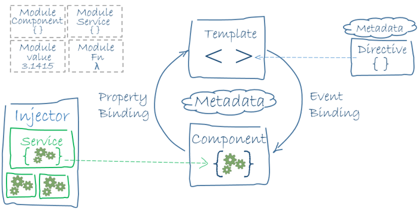

# Basics

Angular is written in TypeScript. The basic building blocks of an Angular application are _NgModules_, which provide a compilation context for _components_.

An app always has at least a _root module_ that enables bootstrapping, and typically has many more _feature modules_.

* Components define _views_, which are sets of screen elements that Angular can choose among and modify according to your program logic and data.
* Components use _services_, which provide specific functionality not directly related to views. Service providers can be _injected_ into components as _dependencies_, making your code modular, reusable, and efficient.

Components define _views_ and use _services_, which provide specific functionality not directly related to views.



## NgModule

Modules are a great way to organize an application and extend it with capabilities from external libraries.

Angular libraries are NgModules, such as [`FormsModule`](https://angular.io/api/forms/FormsModule), [`HttpClientModule`](https://angular.io/api/common/http/HttpClientModule), and [`RouterModule`](https://angular.io/api/router/RouterModule). Many third-party libraries are available as NgModules such as [Material Design](https://material.angular.io/), [Ionic](https://ionicframework.com/), and [AngularFire2](https://github.com/angular/angularfire2).

NgModules consolidate components, directives, and pipes into cohesive blocks of functionality, each focused on a feature area, application business domain, workflow, or common collection of utilities.

Modules can also add services to the application. Such services might be internally developed, like something you'd develop yourself or come from outside sources, such as the Angular router and HTTP client.

Modules can be loaded eagerly when the application starts or lazy loaded asynchronously by the router.

### NgModule metadata

An NgModule is defined by a class decorated with @NgModule().

The most important properties are as follows:

* **declarations:** The components, directives, and pipes that belong to this NgModule.
* **exports:** The subset of declarations that should be visible and usable in the component templates of other NgModules.
* **imports:** Other modules whose exported classes are needed by component templates declared in this NgModule.
* **providers:** Creators of services that this NgModule contributes to the global collection of services; they become accessible in all parts of the app. (You can also specify providers at the component level, which is often preferred.)
* **bootstrap:** The main application view, called the root component, which hosts all other app views. Only the root NgModule should set the bootstrap property.


```javascript
import { NgModule }      from '@angular/core';
import { BrowserModule } from '@angular/platform-browser';
@NgModule({
  imports:      [ BrowserModule ],
  providers:    [ Logger ],
  declarations: [ AppComponent ],
  exports:      [ AppComponent ],
  bootstrap:    [ AppComponent ]
})
export class AppModule { }
```


### NgModules and components

A root NgModule always has a root component that is created during bootstrap, but any NgModule can include any number of additional components, which can be loaded through the router or created through the template. The components that belong to an NgModule share a _compilation_ context provided by their NgModules.

When you create a component, it's associated directly with a single view, called the _**host view**_**.** The host view can be the root of a view hierarchy, which can contain _embedded views_, which are in turn the host views of other components.

## Launching your app with a root module

When you use the [Angular CLI](https://angular.io/cli) command `ng new` to generate an app, the default `AppModule` looks like the following:

```typescript
/* JavaScript imports */
import { BrowserModule } from '@angular/platform-browser';
import { NgModule } from '@angular/core';

import { AppComponent } from './app.component';

/* the AppModule class with the @NgModule decorator */
@NgModule({
  declarations: [
    AppComponent
  ],
  imports: [
    BrowserModule
  ],
  providers: [],
  bootstrap: [AppComponent]
})
export class AppModule { }y
```

The `@`[`NgModule`](https://angular.io/api/core/NgModule) decorator identifies `AppModule` as an [`NgModule`](https://angular.io/api/core/NgModule) class. `@`[`NgModule`](https://angular.io/api/core/NgModule) takes a metadata object that tells Angular how to compile and launch the application.

| METADATA OBJECT | DETAILS                                                                                                                                                              |
| --------------- | -------------------------------------------------------------------------------------------------------------------------------------------------------------------- |
| declarations    | This application's lone component.                                                                                                                                   |
| imports         | Import [`BrowserModule`](https://angular.io/api/platform-browser/BrowserModule) to have browser-specific services such as DOM rendering, sanitization, and location. |
| providers       | The service providers.                                                                                                                                               |
| bootstrap       | The _root_ component that Angular creates and inserts into the `index.html` host web page.                                                                           |
