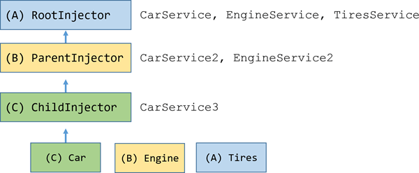

# Architecture

Angular is written in TypeScript. The basic building blocks of an Angular application are _NgModules_, which provide a compilation context for _components_.

Components define _views_ and use _services_, which provide specific functionality not directly related to views.

